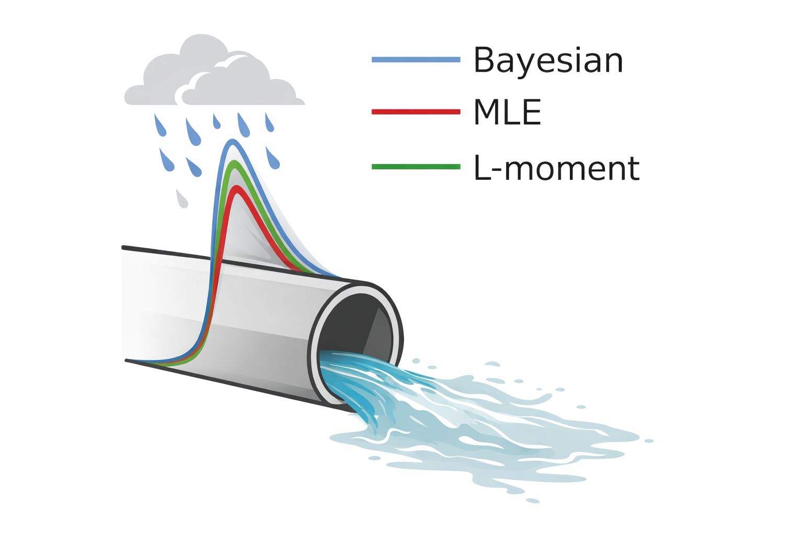
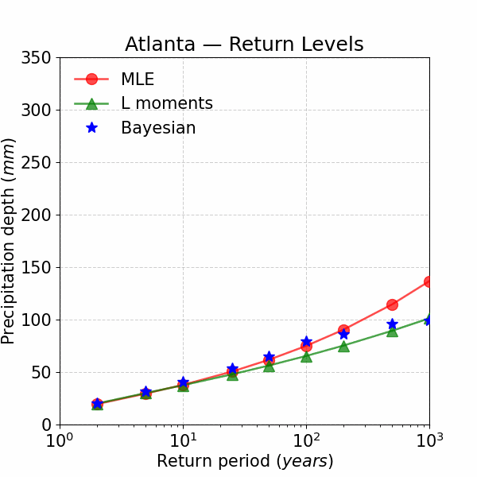
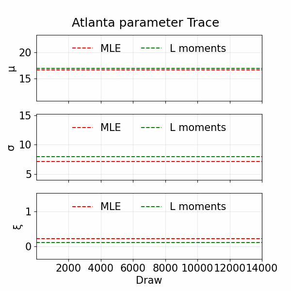

# BaRaN

> Ba(yesian) Ra(infall extremes) N(etwork design). This repository presents Bayesian, Maximum Likelihood, and L-moments inference methods' effect on IDF curve computation — and how those choices impact urban drainage design. This GitHub repository accompanies the manuscript *Uncertainty due to limited extreme-rainfall records is consequential for infrastructure design adaptation across the US* (submitted to Nature Communications).

[](https://jupyter.org)
[](https://www.python.org/)
[](#-license)

---

## 🌧️ Overview

This repository implements end-to-end workflows to estimate **Intensity–Duration–Frequency (IDF)** curves using:
- **Bayesian inference**
- **Maximum Likelihood Estimation (MLE)**
- **Linear moments (L-moments)**

It compares the three approaches, quantifies method-dependent biases, and propagates those differences to **drainage design** decisions (pipe sizing).

<p align="center" style="margin-top: 0px; margin-bottom: 0;">
  
</p>

<p align="center" style="margin-top: 0px; margin-bottom: 0;">
  
  
</p>

<p align="center" style="margin-top: 1px;">
  <em>Figure: Comparison of pipe sizes for 2–1000-year events using Bayesian, MLE, and L-moments methods (upper center panel); parameter traces (lower right panel); and return-levels (lower left panel) for Atlanta.</em>
</p>

---

## 📁 Repository Structure

```
BMM-IDF4DRAINAGE/
├─ Data curation/
│  ├─ AORC/
│  │  └─ AORC_data.ipynb
│  └─ CMIP6/
│     └─ NASA/
│        └─ Projected_precipitation_daily.ipynb
├─ Environment/
├─ GIF/
├─ Model/
│  ├─ Bayesian.ipynb
│  ├─ MLE.ipynb
│  ├─ lmoments.ipynb
│  └─ pipe sizing.ipynb
├─ Numerical experiments/
│  ├─ Noisy Nonstationry
│  │   ├─ Bias_Bayesian.ipynb
│  │   ├─ Bias_MLE.ipynb
│  │   └─ Bias_lmoments.ipynb
│  ├─ Noisy Stationary 
│  │   ├─ Bias_Bayesian.ipynb
│  │   ├─ Bias_MLE.ipynb
│  │   └─ Bias_lmoments.ipynb
│  └─ Stationary
│      ├─ Bias_Bayesian.ipynb
│      ├─ Bias_MLE.ipynb
│      └─ Bias_lmoments.ipynb
├─ Visualization/
│  └─ Visualization.ipynb
├─ Licence/
└─ README.md
```

---

## 🔬 Methodology (High level)
- Data curation: Ingest AORC / CMIP6 / NASA precipitation.

- Fit distributions: computes IDF GEV parameters with Bayesian, MLE, and MOM.

- Bias analysis: Quantify differences across methods (Numerical experiments).

- Design impact: Translate IDF differences into hydraulic pipe sizing.

- Visualization: Plot comparative IDF curves, bias summaries, and pipe sizes.

---

## Getting Started

To run the analysis:

1. Clone the repository:
   ```bash
   git clone https://github.com/omidemam/BaRaN.git
   cd BaRaN
   ```

## 📬 Contact

For questions, feedback, or collaboration opportunities, please email me at: [omid.emamjomehzadeh@nyu.edu](mailto:omid.emamjomehzadeh@nyu.edu)


   
## 📚 Citation

If you use this repository in your research or projects, please cite it as follows:

BibTeX format:

```bibtex
@misc{Emamjomehzadeh2026BaRaN,
  author       = {Emamjomehzadeh, Omid and Qureshi, Dawar and Cook, Lauren M. and Mascaro, Giuseppe and Aghakouchak, Amir and Mahoney, Kelly and Zarei, Seyedamirhossein and Wani, Omar},
  title        = {BaRaN: Bayesian Rainfall extremes Network design},
  year         = {2026},
  note         = {GitHub repository accompanying the manuscript ``Uncertainty due to limited extreme-rainfall records is consequential for drainage design adaptation across the US'' (submitted to Nature Communications)},
  howpublished = {\url{https://github.com/omidemam/BaRaN.git}},
}


